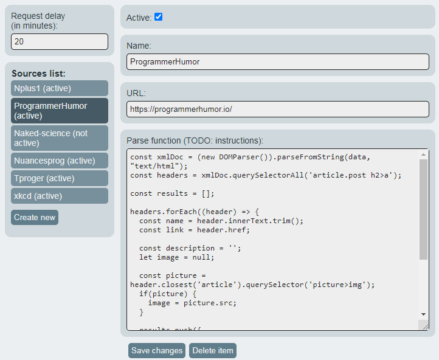

# Programmer's news reader

This Google Chrome extension allows user to read news feeds from sites even if they have no RSS feed. However, user need to be a programmer to configure source; because writing of parse function is upon user.

Fetched news is accessible through extension pop-up window:


Sorces are configured through extension options:



To configure sources, see [setting sources](#setting-sources) section below.

## Project structure

- `dist/` - Here lies the extension itself. Notable files are:
  - `background-db.js` - Database singleton, that used not only by chrome extension background script, but also by options page React application. It provides async interface for IndexedDB storage.
  - `background-settings.js` - Provides async interface for `chrome.storage.sync` methods. Used in background script and in React apps.
  - `interfaces.js` - JSDoc file to share types between background application and react applications.
- `docs/images` - Images for this readme and examples.
- `src/` - Source code for react applications. Options page and pop-up window are two separated React apps.
  - `src/options/` - Source code for extension options page React application.
  - `src/popup/` - Source code for pop-up window React application.

## Installation

Install dependencies:

```bash
npm install
```

Build components that written in React:

`npm run <script>`:

- `build-dev` - build application in watch mode,
- `build-production` - build application in production mode,

## Setting sources

To set the news source you need to open Chrome Extension options page and add sources. Each source is needs to be named, must have a valid url, and have parse content function.

Parse function have access to `data` variable (string), that contains content, requested by extension for user-provided URL. Parse function must return an array of *news item* objects, that contain fields: `title`, `description`, `link`, `image`. All of them are `string` type. `image` field is optional and may contain image src attribute.

Examples of such functions are listed below.

Example of XML parse function:
```js
const xmlDoc = (new DOMParser()).parseFromString(data, "application/xml");
const items = [...xmlDoc.querySelectorAll('channel>item')];

const results = [];

function getCleanContent (input) {
  const output = input.replace('<![CDATA[', '').replace(']]>', '');
  return output.trim();
}

items.forEach((item) => {
  results.push({
    name: getCleanContent(item.querySelector('title').innerHTML),
    description: getCleanContent(item.querySelector('description').innerHTML),
    link:  getCleanContent(item.querySelector('link').innerHTML)
  });
});

return results;
```

Example of HTML parse function:
```js
const htmlDoc = (new DOMParser()).parseFromString(data, "text/html");
const headers = htmlDoc.querySelectorAll('article.post h2>a');

const results = [];

headers.forEach((header) => {
  const name = header.innerText.trim();
  const link = header.href;

  const description = '';
  let image = null;

  const picture = header.closest('article').querySelector('picture>img');
  if(picture) {
    image = picture.src;
  }

  results.push({
    name,
    link,
    description,
    image
  });
});

return results;
```
